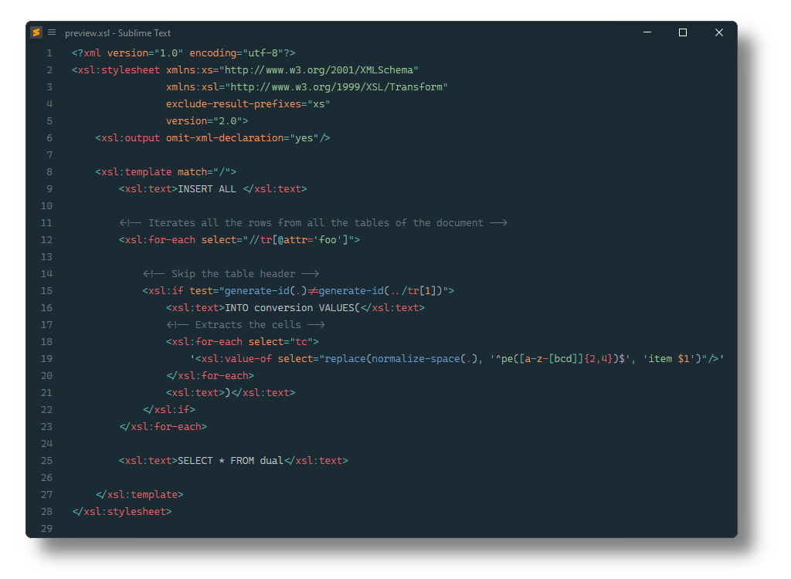

# XSL

Sublime Text Syntax definition, completions and snippets for [XPath](https://www.w3.org/TR/xpath), [XML Schema](https://www.w3.org/XML/Schema) and [XML Stylesheet Transformation](https://www.w3.org/TR/xslt20/) files.



## Installation

### Package Control

The easiest way to install is using [Package Control](https://packagecontrol.io). It's listed as `XSL`.

1. Open `Command Palette` using <kbd>ctrl+shift+P</kbd> or menu item `Tools → Command Palette...`
2. Choose `Package Control: Install Package`
3. Find `XSL` and hit <kbd>Enter</kbd>

### Manual Install

1. Download appropriate [XSL-2.0.0-stxxxx.sublime-package](https://github.com/SublimeText/XSL/releases) for your Sublime Text build.
   _The `st4xxx` suffix denotes the least required ST build for the sublime-package to work._
2. Rename it to _Astro.sublime-package_
3. Copy it into _Installed Packages_ directory

> [!NOTE]
>
> To find _Installed Packages_...
>
> 1. call _Menu > Preferences > Browse Packages.._
> 2. Navigate to parent folder

## Usage

### Begin a Document

To easily start a new XML Schema or Stylesheet ...

1. Open `Command Palette` using <kbd>ctrl+shift+P</kbd> or menu item `Tools → Command Palette...`
2. Execute one of:
   - `New XML Schema...`
   - `New XML Stylesheet...`
   - `New XML Stylesheet 1.0 (exslt)...`

### Deactivate Snippets

To ignore snippets that are provided by default, 
add them to `ignored_snippets` setting.

| ignored snippets | values
|------------------|--------------------------------------
| all              | `"XSL/Snippets/*"`
| XSD              | `"XSL/Snippets/XSD/*"`
| XSLT             | `"XSL/Snippets/XSLT/*"`

To only keep schema related snippets...

```json
{
    "ignored_snippets": [
        "XSL/Snippets/XSLT",
    ],
}
```


### Main Snippets

Snippets to start a new document with.

#### schema-10

Start a new XML Schema Version 1.0

```
<?xml version="1.0" encoding="UTF-8"?>
<xs:schema
  xmlns:xs="http://www.w3.org/2001/XMLSchema"
  xmlns:vc="http://www.w3.org/2007/XMLSchema-versioning" vc:minVersion="1.0" vc:maxVersion="1.1"
  xmlns="${1:http://my-namespace}"
  targetNamespace="${1:http://my-namespace}"
  elementFormDefault="qualified"
  attributeFormDefault="unqualified">

  $0
</xs:schema>
```

#### schema-11

Start a new XML Schema Version 1.1

```
<?xml version="1.0" encoding="UTF-8"?>
<xs:schema
  xmlns:xs="http://www.w3.org/2001/XMLSchema"
  xmlns:vc="http://www.w3.org/2007/XMLSchema-versioning" vc:minVersion="1.1"
  xmlns="${1:http://my-namespace}"
  targetNamespace="${1:http://my-namespace}"
  elementFormDefault="qualified"
  attributeFormDefault="unqualified">

  $0
</xs:schema>
```

#### stylesheet

Start a new XML Stylesheet Version 2.0 or 3.0

```
<?xml version="1.0" encoding="utf-8"?>
<xsl:stylesheet xmlns:xs="http://www.w3.org/2001/XMLSchema"
        xmlns:xsl="http://www.w3.org/1999/XSL/Transform"
        exclude-result-prefixes="xs"
        version="${1:2.0}">
  <xsl:output method="xml" version="1.0" encoding="utf-8" indent="yes"/>

  <xsl:template match="${2}">
    ${0}
  </xsl:template>
</xsl:stylesheet>
```

#### stylesheet-exslt

Start a new XML Stylesheet Version 1.0 with basic EXSL extension.

```
<?xml version="1.0" encoding="utf-8"?>
<xsl:stylesheet xmlns:xsl="http://www.w3.org/1999/XSL/Transform"
        xmlns:exsl="http://exslt.org/common"
        extension-element-prefixes="exsl"
        version="1.0">
  <xsl:output method="xml" version="1.0" encoding="utf-8" indent="yes"/>

  <xsl:template match="${1}">
    ${0}
  </xsl:template>
</xsl:stylesheet>
```

#### stylesheet-exslt-all

Start a new XML Stylesheet Version 1.0 with all EXSL extensions.

```
<?xml version="1.0" encoding="utf-8"?>
<xsl:stylesheet xmlns:xsl="http://www.w3.org/1999/XSL/Transform"
        xmlns:exsl="http://exslt.org/common"
        ${1:xmlns:date="http://exslt.org/dates-and-times"}
        ${2:xmlns:dynamic="http://exslt.org/dynamic"}
        ${3:xmlns:math="http://exslt.org/math"}
        ${4:xmlns:regexp="http://exslt.org/regular-expressions"}
        ${5:xmlns:sets="http://exslt.org/sets"}
        ${6:xmlns:str="http://exslt.org/strings"}
        extension-element-prefixes="exsl${7: date}${8: dynamic}${9: math}${10: regexp}${11: sets}${12: str}"
        version="1.0">
  <xsl:output method="xml" version="1.0" encoding="utf-8" indent="yes"/>

  <xsl:template match="${13}">
    ${0}
  </xsl:template>
</xsl:stylesheet>
```


#### XSLT Snippets

Snippets to work with XSL transformation.

#### ai

```
<xsl:apply-imports />
```

#### apw

```
<xsl:apply-templates${1: select="${2}"}${3: mode="${4}"}>
  <xsl:with-param name="${5}" select="${6}"/>
</xsl:apply-templates>
```

#### ap

```
<xsl:apply-templates${1: select="${2}"}${3: mode="${4}"} />
```

#### attrs

```
<xsl:attribute-set name="${1}"${2: use-attribute-sets="${3}"}>${4}</xsl:attribute-set>
```

#### attr

```
<xsl:attribute name="${1}"${2: namespace="${3}"}>${0}</xsl:attribute>
```

#### callw

```
<xsl:call-template name="${1}">
  <xsl:with-param name="${2}" select="${3}"/>
</xsl:call-template>
```

#### call

```
<xsl:call-template name="${1}" />
```

#### cw

```
<xsl:choose>
  <xsl:when test="${1}">${2}</xsl:when>
  ${3:<xsl:otherwise>${0}</xsl:otherwise>}
</xsl:choose>
```

#### ch

```
<xsl:choose>
  ${0}
</xsl:choose>
```

#### com

```
<xsl:comment>${0}</xsl:comment>
```

#### cpo

```
<xsl:copy-of select="${1}" />
```

#### cp

```
<xsl:copy${1: use-attribute-sets="${2}"}>${0}</xsl:copy>
```

#### dec

```
<xsl:decimal-format ${1:name="${2}"}${3: decimal-separator="${4}"}${5: grouping-separator="${6}"}${7: infinity="${8}"}${9: minus-sign="${10}"}${11: NaN="${12}"}${13: percent="${14}"}${15: per-mile="${16}"}${17: zero-digit="${18}"}${19: digit="${20}"}${21: pattern-separator="${22}"} />
```

#### doci

```
<xsl:document href="${1}" method="${2}" version="${3:1.0}" encoding="${4:utf-8}" indent="${5}"${6: omit-xml-declaration="${7}"}${8: standalone="${9}"}${10: media-type="${11:application/xml}"}${12: doctype-public="${13:-//W3C//DTD XHTML 1.0 Strict//EN}"}${14: doctype-system="${15:http://www.w3.org/TR/xhtml1/DTD/xhtml1-strict.dtd}"}${16: cdata-section-elements="${17}"}>
  ${0}
</xsl:document>
```

#### doc

```
<xsl:document href="${1}" method="${2}" version="${3:1.0}" encoding="${4:utf-8}" indent="${5}"${6: omit-xml-declaration="${7}"}${8: standalone="${9}"}${10: media-type="${11:application/xml}"}${12: doctype-public="${13:-//W3C//DTD XHTML 1.0 Strict//EN}"}${14: doctype-system="${15:http://www.w3.org/TR/xhtml1/DTD/xhtml1-strict.dtd}"}${16: cdata-section-elements="${17}"}/>
```

#### elt

```
<xsl:element name="${1}"${2: namespace="${3}"}>
  ${0}
</xsl:element>
```

#### fb

```
<xsl:fallback>${0}</xsl:fallback>
```

#### for

```
<xsl:for-each select="${1}">
  ${0}
</xsl:for-each>
```

#### if

```
<xsl:if test="${1}">${0}</xsl:if>
```

#### imp

```
<xsl:import href="${1}" />
```

#### inc

```
<xsl:include href="${1}" />
```

#### key

```
<xsl:key name="${1}" match="${2}" use="${3}" />
```

#### msg

```
<xsl:message${1: terminate="${2}"}>${0}</xsl:message>
```

#### nam

```
<xsl:namespace-alias stylesheet-prefix="${1}" result-prefix="${2}" />
```

#### num

```
<xsl:number level="${1}" count="${2}" from="${3}" value="${4}" format="${5}" lang="${6}" letter-value="${7}" grouping-separator="${8}" grouping-size="${9}" />
```

#### ot

```
<xsl:otherwise>${0}</xsl:otherwise>
```

#### out

```
<xsl:output method="${1}" version="${2:1.0}" encoding="${3:utf-8}" indent="${4}"${5: omit-xml-declaration="${6}"}${7: standalone="${8}"}${9: media-type="${10:application/xml}"}${11: doctype-public="${12:-//W3C//DTD XHTML 1.0 Strict//EN}"}${13: doctype-system="${14:http://www.w3.org/TR/xhtml1/DTD/xhtml1-strict.dtd}"}${15: cdata-section-elements="${16}"} />
```

#### pari

```
<xsl:param name="${1}">${0}</xsl:param>
```

#### par

```
<xsl:param name="${1}"${2: select="${3}"} />
```

#### pres

```
<xsl:preserve-space elements="${1}" />
```

#### proc

```
<xsl:processing-instruction name="${1}">${0}</xsl:processing-instruction>
```

#### scr

```
<xsl:script implements-prefix="${1}" language="${2}" src="${3}" archive="${4}">${0}</xsl:script>
```

#### sort

```
<xsl:sort select="${1}"${2: data-type="${3}"}${4: order="${5}"}${6: case-order="${7}"}${8: lang="${9}"} />
```

#### strip

```
<xsl:strip-space elements="${1}" />
```

#### tm

```
<xsl:template match="${1}"${2: mode="${3}"}>
  ${0}
</xsl:template>
```

#### tn

```
<xsl:template name="${1}"${2: mode="${3}"}>
  ${0}
</xsl:template>
```

#### txt

```
<xsl:text />
```

#### text

```
<xsl:text${1: disable-output-escaping="${2}"}>${0}</xsl:text
```

#### val

```
<xsl:value-of select="${1}"${2: disable-output-escaping="${3}"} />
```

#### vari

```
<xsl:variable name="${1}">${0}</xsl:variable>
```

#### var

```
<xsl:variable name="${1}"${2: select="${3}"} />
```

#### wh

```
<xsl:when test="${1}">${0}</xsl:when>
```

#### wpi

```
<xsl:with-param name="${1}">${0}</xsl:with-param>
```

#### wp

```
<xsl:with-param name="${1}" select="${2}" />
```

## Troubleshooting

### §1 Syntax Definition Parse Errors

XSL extends Sublime Text's _Regular Expressions_ and _XML_ syntax definition.

If XSL syntax highlighting doesn't work 
and console displays syntax errors in _XSD.sublime-syntax_ or _XSL.sublime-syntax_
please make sure to remove any out-dated syntax override.

Steps:

1. call _Menu > Preferences > Browse Packages.._
2. Look for _XML_ folder
3. Remove it or at least delete any syntax definition in it.
